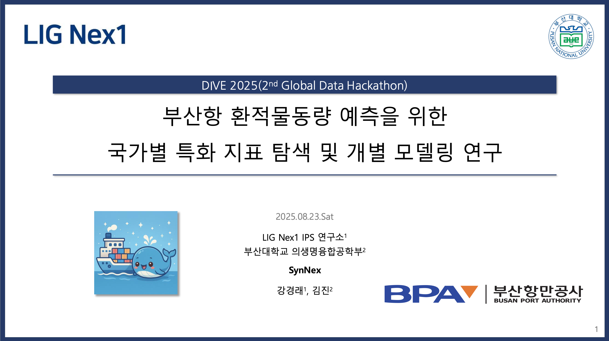
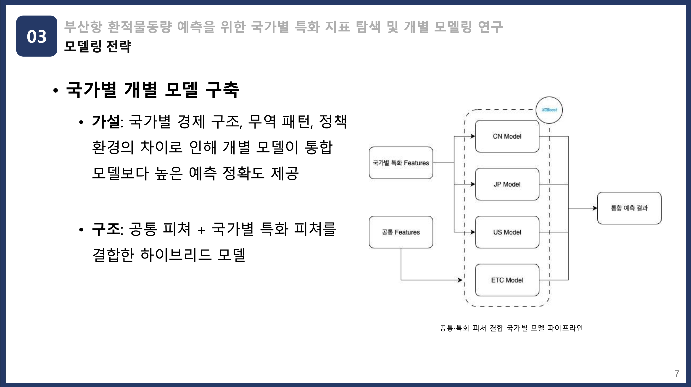

# DIVE 2025 — 부산항 환적물동량 예측

**행사**: DIVE 2025 (2nd Global Data Hackathon)  
**주제**: 국가별 특화 지표를 활용한 부산항 환적 물동량(TEU) 예측  
**결과**: 발제사 부문 **3위 (3rd Place)**  
**팀 구성**: 팀장 **김진**, 팀원 **강경래**

[📄 발표자료 PDF 보기](./DIVE2025_ver_fin.pdf)

---

## 1) 프로젝트 개요

부산항은 **세계 2위 환적 허브항**으로, 국가별로 상이한 무역 구조·경기 주기·정책 변화가 물동량 패턴에 직접적인 영향을 줍니다. 본 프로젝트는 **공통 거시/물류 지표**와 **국가별 특화 지표**를 결합해 **국가별 개별 예측 모델**을 구축, 통합 단일 모델 대비 **세밀하고 설명 가능한 예측**을 목표로 했습니다.

**핵심 포인트**
- 국가별 독립 예측(예: XGBoost 기반)로 각국의 **계절성/구조적 차이** 반영
- Feature Importance로 **영향 변수 설명력** 확보
- 정책·외생 변수 변화에 대한 **민첩한 시나리오 대응** 가능

---

## 2) 팀 소개

| 역할 | 이름 | 소개 |
|---|---|---|
| 팀장 | **김진** | 피처 엔지니어링·모델 설계·총괄 |
| 팀원 | **강경래** | 데이터 수집·평가·발표 |

---

## 3) 문제 정의 & 배경

- 국가별 환적 물동량은 상호 상관이 낮고, **독립적 요인**이 큼  
- 단일(통합) 모델은 국가별 **이질성**을 과소모형화할 가능성  
- → **국가별 개별 모델** + **공통/특화 지표 결합** 전략이 타당

---

## 4) 데이터 & 피처(요약)

**공통 피처**  
- **OECD 종합선행지수(CLI)**: 글로벌 경기 선행  
- **Europe Brent Spot Price(Brent)**: 운송·교역 비용 압력  
- **RWI/ISL Container Throughput Index**: 전 세계 컨테이너 물동 흐름

**국가별 특화 피처**  
- **중국(CN)**: 제조업 PMI, 주요 항만/해운 기업 주가  
- **미국(US)**: 소비·운송 ETF(XLY/IYT), 글로벌 해운사 지표(Maersk 등)  
- **일본(JP)**: 제조업 PMI/생산지수, 부품·장비 수출 동향

> 월 단위 정렬, 결측/이상치 처리, 필요 시 차분/정규화, 타깃(TEU)의 **lag 피처** 포함.

---

## 5) 모델링 전략

- **국가별 개별 XGBoost**: 공통 + 국가별 특화 피처 결합  
- **평가**: 시계열 분할(TimeSeriesSplit)로 **미래 예측 성능** 검증  
- **해석**: Feature Importance로 주요 변수 영향 분석

---

## 6) 결과 요약

- **국가별 모델**이 통합 단일 모델 대비 **RMSE에서 일관된 소폭 개선**  
- 데이터 기간 확장 및 특화 피처 정교화 시 **추가 개선 여지** 큼  
- 운영 측면: 각국 이슈(관세·규제·수요충격)에 대한 **맞춤형 설명/시뮬레이션** 가능

**시사점**
- 비약적 향상보다 **설명 가능하고 운용 친화적인 구조** 확보  
- 전략·정책 변화 대응을 위한 **국가별 민감도 분석 프레임** 마련

---

## 7) 수상

- DIVE 2025 발제사 부문 **3위 (3rd Place)**

---

## 8) 문의

- 팀장: **김진**  
- 팀원: **강경래**  
- 제안/문의는 GitHub Issues로 남겨주세요.
